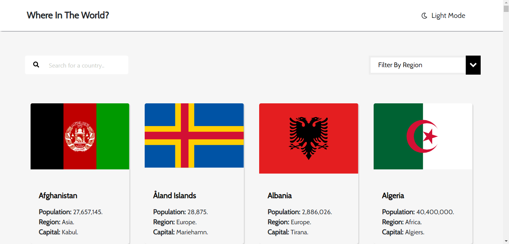
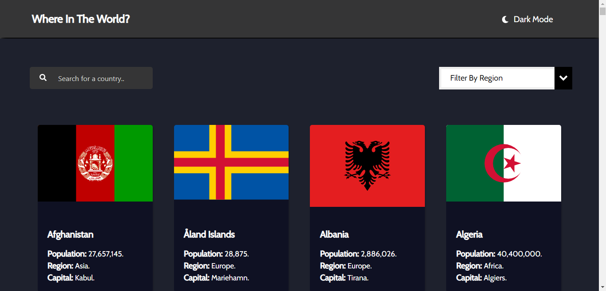
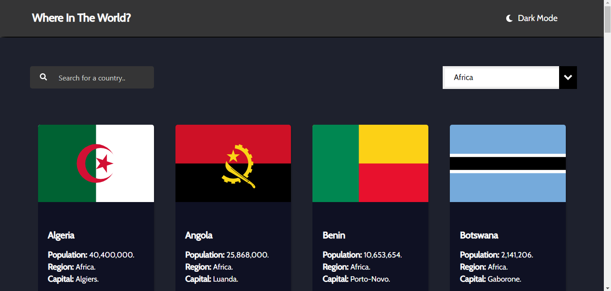
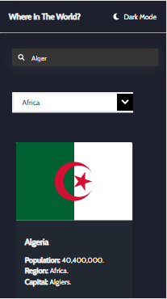
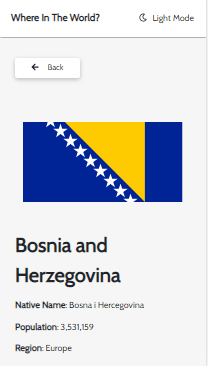

# Getting Started with Kountries

Kountries is built using React js

## What Kountries Does

Kountries uses the https://restcountries.eu/ restful services to display information about over 249 countries in the world with their details included.
The project comes with dark mode,although that feature is not yet cached,meaning a browser exit or refresh changes it back to light mode. It comes with a search and filter feature.

## Images from Project

